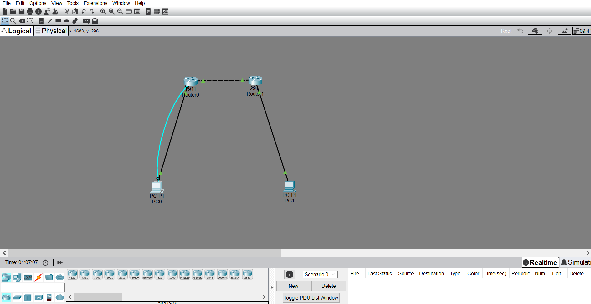
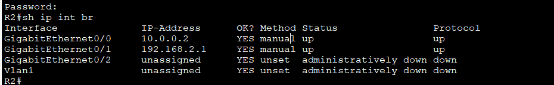
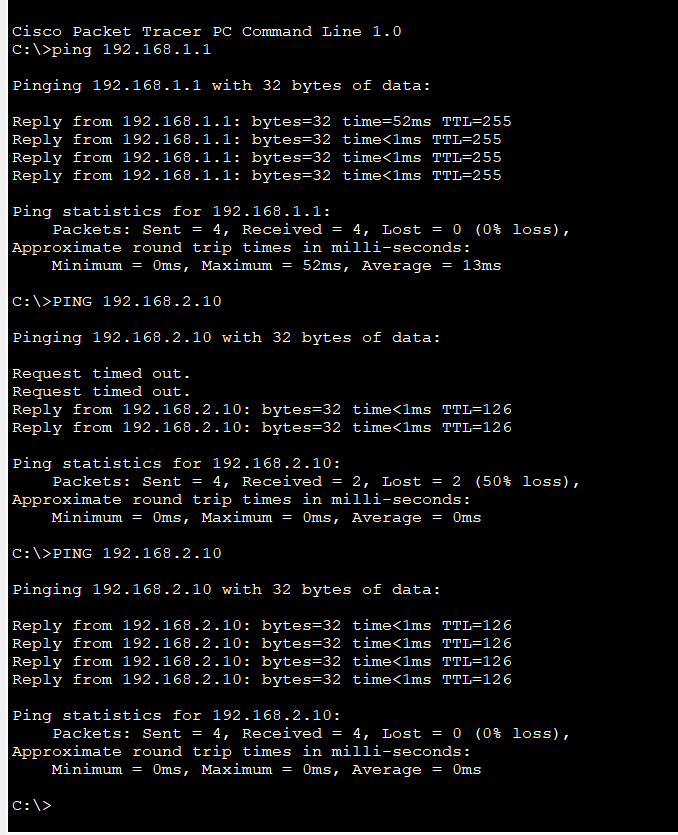

# TP1 - Cisco Static Routing Configuration

**Author:** ALPHA Ziad Ramdan  
**Institution:** ISM Dakar - L1 Cybersecurity  
**Date:** March 11, 2026  
**Tool:** Cisco Packet Tracer  

---

## Objective

Configure two Cisco 2911 routers with static routing to enable end-to-end communication between two separate LANs.

---

## Network Topology



---

## IP Addressing Plan

| Device | Interface    | IP Address     | Subnet Mask       | Role              |
|--------|-------------|----------------|-------------------|-------------------|
| R1     | Gi0/0       | 192.168.1.1    | 255.255.255.0     | Gateway LAN1      |
| R1     | Gi0/1       | 10.0.0.1       | 255.255.255.252   | Link to R2        |
| R2     | Gi0/0       | 10.0.0.2       | 255.255.255.252   | Link to R1        |
| R2     | Gi0/1       | 192.168.2.1    | 255.255.255.0     | Gateway LAN2      |
| PC0    | NIC         | 192.168.1.10   | 255.255.255.0     | Host LAN1         |
| PC1    | NIC         | 192.168.2.10   | 255.255.255.0     | Host LAN2         |

---

## Static Routes

| Router | Destination Network | Subnet Mask     | Next Hop  |
|--------|---------------------|-----------------|-----------|
| R1     | 192.168.2.0         | 255.255.255.0   | 10.0.0.2  |
| R2     | 192.168.1.0         | 255.255.255.0   | 10.0.0.1  |

---

## Security Configuration

Each router is secured with:

- Enable secret password: `cisco`
- Console password: `cisco1`
- VTY (remote access) password: `cisco12`
- Service password encryption enabled
- Login banner: `Acces strictement interdit`

---

## Verification

### Interface Status (R2)



### Ping Results - PC0 to PC1



The first 2 packets may be lost due to ARP resolution. From the second attempt onward, 100% success rate is achieved.

---

## Skills Acquired

- IP addressing and subnetting (/24 and /30 masks)
- Static routing between two networks
- Cisco router security configuration
- End-to-end connectivity testing
- Network documentation (FR and EN)

---

## Repository Structure

```
cisco-routing-labs/
├── README-EN.md
├── README-FR.md
├── TP1_Configs_ALPHA_Ziad_EN.txt
├── TP1_Configs_ALPHA_Ziad_FR.txt
├── TP1_Cisco_ALPHA_Ziad_EN.docx
├── TP1_Cisco_ALPHA_Ziad_FR.docx
├── topology.png
├── show_ip_int_br_r2.png
└── ping_results.png
```
