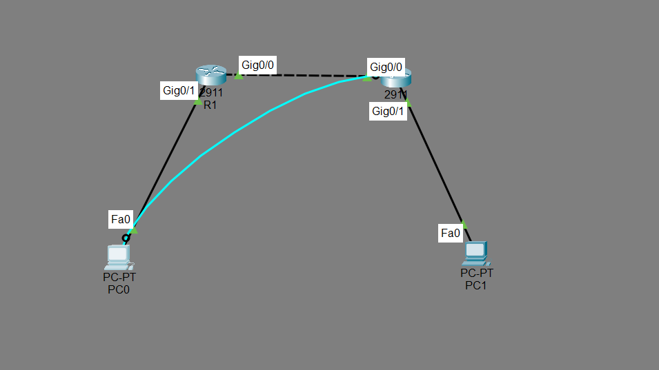
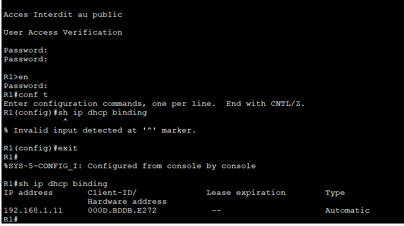
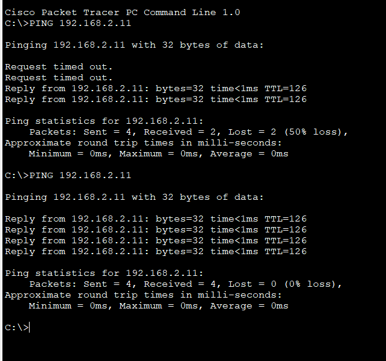

# TP2 - Configuration DHCP sur Routeur Cisco

**Auteur** : ALPHA Ziad Ramdan
**Filiere** : L1 Cybersecurite
**Ecole** : Institut Superieur de Management (ISM) - Dakar, Senegal
**Date** : 15 Mars 2026
**Outil** : Cisco Packet Tracer 8.2.2 - Routeur Cisco 2911

---

## Description

Configuration du service DHCP sur deux routeurs Cisco 2911. Les PCs obtiennent leur adresse IP, masque, passerelle et DNS automatiquement sans configuration manuelle. Ce TP est la suite directe du TP1 sur le routage statique.

---

## Topologie du reseau



```
PC0 (DHCP - LAN1)
        |
     [Gi0/1]
        R1  <-- Serveur DHCP pour LAN1 (192.168.1.0/24)
     [Gi0/0]
        |
   10.0.0.0/30
        |
     [Gi0/0]
        R2  <-- Serveur DHCP pour LAN2 (192.168.2.0/24)
     [Gi0/1]
        |
PC1 (DHCP - LAN2)
```

---

## Plan d'adressage IP

| Equipement | Interface | Adresse IP | Masque | Gateway |
|------------|-----------|------------|--------|---------|
| R1 | Gi0/1 | 192.168.1.1 | 255.255.255.0 /24 | - |
| R1 | Gi0/0 | 10.0.0.1 | 255.255.255.252 /30 | - |
| R2 | Gi0/0 | 10.0.0.2 | 255.255.255.252 /30 | - |
| R2 | Gi0/1 | 192.168.2.1 | 255.255.255.0 /24 | - |
| PC0 | Fa0 | DHCP (recu : 192.168.1.11) | 255.255.255.0 /24 | 192.168.1.1 |
| PC1 | Fa0 | DHCP (recu : 192.168.2.11) | 255.255.255.0 /24 | 192.168.2.1 |

---

## C'est quoi le DHCP ?

Sans DHCP (TP1) : on configure manuellement l'IP de chaque PC.

Avec DHCP (TP2) : le PC envoie une requete et le routeur lui attribue automatiquement une IP, un masque, une gateway et un DNS.

Ce processus s'appelle DORA :
- D - Discover : le PC cherche un serveur DHCP
- O - Offer : le routeur propose une IP disponible
- R - Request : le PC accepte l'offre
- A - Acknowledge : le routeur confirme l'attribution

---

## Configuration DHCP sur R1 (pour LAN1)

```
enable
configure terminal
ip dhcp pool LAN1
network 192.168.1.0 255.255.255.0
default-router 192.168.1.1
dns-server 8.8.8.8
exit
ip dhcp excluded-address 192.168.1.1 192.168.1.10
end
wr
```

Explication des commandes :

| Commande | Description |
|----------|-------------|
| ip dhcp pool LAN1 | Creer un pool DHCP nomme LAN1 |
| network | Definir la plage d'adresses a distribuer |
| default-router | Passerelle donnee aux clients |
| dns-server | Serveur DNS donne aux clients |
| excluded-address | Adresses reservees non distribuees par DHCP |

---

## Configuration DHCP sur R2 (pour LAN2)

```
enable
configure terminal
ip dhcp pool LAN2
network 192.168.2.0 255.255.255.0
default-router 192.168.2.1
dns-server 8.8.8.8
exit
ip dhcp excluded-address 192.168.2.1 192.168.2.10
end
wr
```

---

## Verification - show ip dhcp binding



```
IP address      Client-ID / Hardware address    Lease expiration    Type
192.168.1.11    000D.BDDB.E272                  --                  Automatic
```

PC0 a bien recu l'adresse 192.168.1.11 automatiquement via DHCP.

---

## Resultats des tests de connectivite



| Source | Destination | Resultat | Observation |
|--------|-------------|----------|-------------|
| PC0 (192.168.1.11) | PC1 (192.168.2.11) | 100% | Communication inter-reseau reussie |

NB : Les 2 premiers paquets perdus lors de la resolution ARP au premier essai. Au second essai : 100% de succes. Comportement normal.

---

## Competences acquises

- Comprendre le fonctionnement du protocole DHCP et le processus DORA
- Configurer un pool DHCP sur un routeur Cisco avec network, default-router, dns-server
- Exclure des adresses avec ip dhcp excluded-address
- Mettre un PC en mode DHCP automatique dans Packet Tracer
- Verifier les attributions DHCP avec show ip dhcp binding
- Combiner DHCP et routage statique sur le meme routeur

---

## Commandes de verification DHCP

| Commande | Description |
|----------|-------------|
| show ip dhcp binding | Affiche les IPs attribuees aux clients |
| show ip dhcp pool | Affiche les details du pool DHCP |
| show ip dhcp conflict | Affiche les conflits d'adresses detectes |

---

*ALPHA Ziad Ramdan - L1 Cybersecurite - ISM Dakar - 15 Mars 2026*
